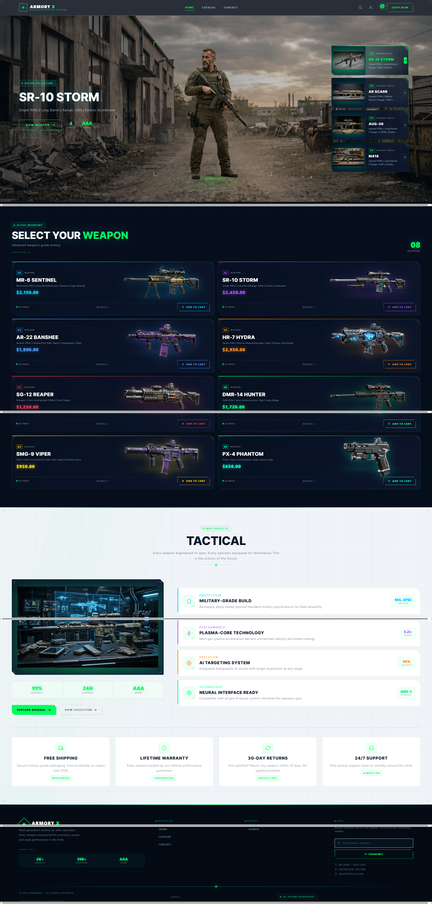
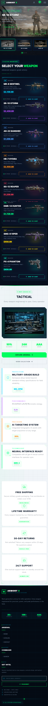

# 

<div align="center">

# ARMORY X

### Advanced Weapon Showcase Built with Shopify Liquid

A premium, fully responsive Shopify storefront designed for modern tactical and weapon showcase brands. Built with Shopify Liquid, optimized for performance, and crafted with a futuristic military-inspired user experience.


</div>

---

## 📱 Responsive Preview

### Desktop Version


### Mobile Version



---

## 🚀 Project Overview

ARMORY X is a fully responsive Shopify storefront built using Shopify Liquid. The website features a futuristic tactical design, immersive product showcases, advanced UI interactions, and a premium shopping experience across all devices.

Designed to deliver a modern military-grade aesthetic while maintaining fast performance and clean user experience.

---

## ✨ Features

### 🎯 Premium Hero Section
- Large cinematic hero banner
- Featured weapon spotlight
- Dynamic product highlights
- Modern tactical interface

### 🛒 Product Showcase
- Custom weapon collection grid
- Product cards with hover effects
- Price and inventory display
- Quick add-to-cart functionality

### 📱 Fully Responsive Design
- Mobile-first development
- Optimized desktop experience
- Tablet compatibility
- Smooth responsive layouts

### ⚡ Performance Optimized
- Lightweight Shopify Liquid architecture
- Optimized assets
- Fast loading experience
- SEO-friendly structure

### 🎨 Advanced UI/UX
- Tactical futuristic styling
- Smooth hover animations
- Modern typography
- Professional visual hierarchy

### 🔧 Shopify Integration
- Shopify Liquid templating
- Dynamic product rendering
- Theme customization support
- Easy content management

---

## 🛠 Tech Stack

| Technology | Purpose |
|------------|---------|
| Shopify Liquid | Theme Development |
| HTML5 | Structure |
| CSS3 | Styling |
| JavaScript | Interactivity |
| Shopify Theme Architecture | Store Management |
| Responsive Design | Mobile Optimization |

---

## 📂 Project Structure

```bash
├── assets/
│   ├── hero-desktop.png
│   ├── hero-mobile.png
│   ├── styles.css
│   ├── theme.js
│   └── images/
│
├── sections/
│   ├── hero.liquid
│   ├── featured-products.liquid
│   ├── tactical-features.liquid
│   └── footer.liquid
│
├── snippets/
│
├── templates/
│
├── layout/
│   └── theme.liquid
│
└── config/
```

---

## 🎨 Key Sections

### Hero Banner
Immersive tactical hero section featuring a highlighted weapon and dynamic product navigation.

### Weapon Catalog
Advanced product showcase with custom-designed weapon cards and interactive shopping experience.

### Tactical Features
Dedicated section highlighting military-grade specifications, AI targeting systems, and advanced weapon technologies.

### Trust Indicators
- Free Shipping
- Lifetime Warranty
- 30-Day Returns
- 24/7 Support

### Footer
Clean navigation, newsletter subscription, and brand information.

---

## 📈 Performance Goals

- ✅ Fully Responsive
- ✅ Mobile Optimized
- ✅ Shopify Compatible
- ✅ SEO Friendly
- ✅ Fast Loading
- ✅ Clean Code Structure
- ✅ Modern UI/UX

---

## ⚙ Installation

Clone the repository:

```bash
git clone https://github.com/ArnavAsif/Fire-Armor.git
```

Navigate into the project:

```bash
cd armory-x
```

Push to Shopify Theme:

```bash
shopify theme push
```

Run Shopify Theme Development:

```bash
shopify theme dev
```

---

## 🔧 Customization

Update the following areas to match your brand:

- Logo
- Hero Images
- Product Collections
- Theme Colors
- Typography
- Feature Sections
- Footer Content

---

## 🌟 Highlights

- Premium Tactical Design
- Shopify Liquid Development
- Fully Responsive Layout
- Mobile & Desktop Optimized
- Advanced Product Showcase
- Modern User Experience
- Performance Focused Architecture

---

## 📸 Screenshots

| Desktop | Mobile |
|----------|---------|
|  |  |

---

## 🤝 Contributing

Contributions, issues, and feature requests are welcome.

Feel free to fork the repository and submit a pull request.

---

## 📄 License

This project is intended for educational and portfolio purposes.

---

## 👨‍💻 Developer

**Arnav Asif**

Shopify Developer | Frontend Developer

Specializing in:
- Shopify Theme Development
- Shopify Liquid
- Responsive Web Design
- Custom Storefront Development
- UI/UX Implementation

---

<div align="center">

### ⭐ If you like this project, don't forget to star the repository.

Built with Shopify Liquid 🚀

</div>
